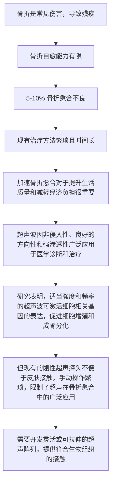

```mermaid
flowchart TD
    A[骨折是常见伤害，导致残疾] --> B[骨折自愈能力有限]
    B --> C[5-10% 骨折愈合不良]
    C --> D[现有治疗方法繁琐且时间长]
    D --> E[加速骨折愈合对于提升生活质量和减轻经济负担很重要]
    E --> F[超声波因非侵入性、良好的方向性和强渗透性广泛应用于医学诊断和治疗]
    F --> G[研究表明，适当强度和频率的超声波可激活细胞相关基因的表达，促进细胞增殖和成骨分化]
    G --> H[但现有的刚性超声探头不便于皮肤接触，手动操作繁琐，限制了超声在骨折愈合中的广泛应用]
    H --> I[需要开发灵活或可拉伸的超声阵列，提供符合生物组织的接触]

```